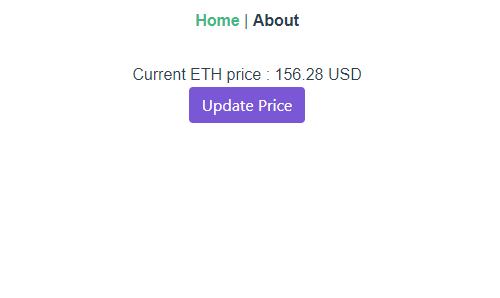

# Ethereum Oraclize starter

Front-end is generated with [vue-cli](https://github.com/vuejs/vue-cli) version 3.2.1

Basic Ethereum Oracle example including Oraclize, Truffle, Coinbase API, Web3

# Demo
Get the current ETH/USD price from the Coinbase API through an Ethereum Oracle 



# Project setup

### Install dependencies
```
npm install
```

### Install Truffle
```
npm install -g truffle 
```

### Run Truffle develop (spawns a development blockchain)
```
truffle develop
```

### Open a seperate terminal and run the ethereum-bridge (see package.json for what it does)
```
npm run bridge
```
Wait till it is fully loaded and you see the following message

```
Please add this line to your contract constructor:

OAR = OraclizeAddrResolverI(address);
```

### Compile the contract inside the Truffle develop console
```
truffle(develop)> compile
```
### Migrate the contract also inside the Truffle develop console
```
truffle(develop)> migrate --development --reset
```

### Get the contract address from the ethereum-bridge terminal
Output should be something like this
```
    "contract_myid": "0x9fa87c542cab950bd129f3d2d13cba6199741bd1984351c04e83c54620dfee1b",
    "contract_address": "0x345ca3e014aaf5dca488057592ee47305d9b3e10"
```

### Copy your contract address into HelloWorld.vue
```
let myContract = new web3.eth.Contract(
  MyContract.abi,
  //Your contract address
  "0x345ca3e014aaf5dca488057592ee47305d9b3e10"
);
```

### Start the project
```
npm run serve
```

Enjoy!
